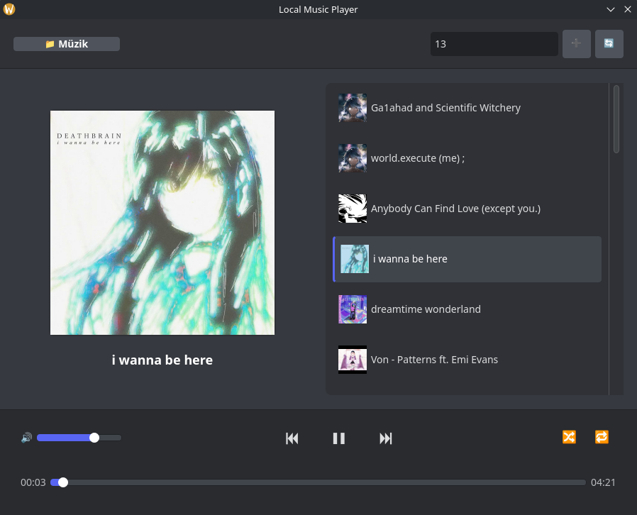

# Local Music Player

A Python-based open-source music player capable of downloading individual tracks or playlists from YouTube and managing local playlists.

  
   

# Installation
### You must download FFmpeg for download musics.
## Linux 
### Download Requirements
    
    pip install -r requirements.txt
  

### For "externally-managed-environment" Error
    
    pip install -r requirements.txt --break-system-packages
  

## Run
    
    python localmusic.py
  
## Windows

### Download Requirements

    python -m pip install -r requirements.txt

## Run

        python localmusic.py

## How To Use
1. **Upon launching, select a Main Directory where you want to store your music.**

2. **Create subfolders manually inside this Main Directory.**

3. **The application will recognize these subfolders as Playlists.**
   
# Linux Native Integration (.desktop)
## Open Terminal:
    
    nano ~/.local/share/applications/localmusicplayer.desktop
    
## Paste And Edit This:
    
     [Desktop Entry]
     Version=1.0
     Type=Application
     Name=A Music Player
     # CHANGE THIS PATH to where your "localmusic.py" is located
     Exec=/usr/bin/python3 /home/YOUR_NAME/localmusic.py
     Icon=/home/YOUR_NAME/logo.png
     Categories=Audio;Music;Player;
     Terminal=false
     StartupNotify=true
    
### Update the desktop database:
    
    update-desktop-database ~/.local/share/applications/
    
